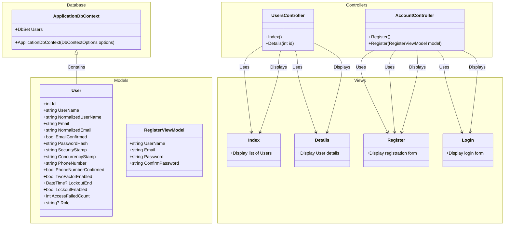

```mermaid

%%{
  init: {
    "theme": "default",
    "themeVariables": {
      "primaryColor": "#d6d6d6",  /* Light gray for class background */
      "primaryTextColor": "#222222",  /* Dark text for contrast */
      "primaryBorderColor": "#666666", /* Medium gray for borders */
      "tertiaryColor": "#f8f9fa", /* Slightly off-white for better visibility */
      "edgeLabelBackground": "#ffffff", /* White edges for clarity */
      "secondaryColor": "#c0c0c0", /* Soft neutral color for secondary elements */
      "tertiaryTextColor": "#333333" /* Ensuring good contrast for tertiary text */
    }
  }
}%%

classDiagram
    %% Grouping Entities into Packages
    namespace Models {
        class User {
            +int Id
            +string UserName
            +string NormalizedUserName
            +string Email
            +string NormalizedEmail
            +bool EmailConfirmed
            +string PasswordHash
            +string SecurityStamp
            +string ConcurrencyStamp
            +string PhoneNumber
            +bool PhoneNumberConfirmed
            +bool TwoFactorEnabled
            +DateTime? LockoutEnd
            +bool LockoutEnabled
            +int AccessFailedCount
            +string? Role
        }

        class RegisterViewModel {
            +string UserName
            +string Email
            +string Password
            +string ConfirmPassword
        }
    }

    namespace Database {
        class ApplicationDbContext {
            +DbSet<User> Users
            +ApplicationDbContext(DbContextOptions<ApplicationDbContext> options)
        }
    }

    namespace Controllers {
        class AccountController {
            +Register()
            +Register(RegisterViewModel model)
        }

        class UsersController {
            +Index()
            +Details(int id)
        }
    }

    namespace Views {
        class Index {
            +Display list of Users
        }

        class Details {
            +Display User details
        }

        class Register {
            +Display registration form
        }

        class Login {
            +Display login form
        }
    }

    %% Relationships
    ApplicationDbContext <|-- User : Contains
    AccountController --> Register : Uses
    UsersController --> Index : Uses
    UsersController --> Details : Uses
    AccountController --> Register : Uses
    AccountController --> Login : Uses
    UsersController --> Index : Displays
    UsersController --> Details : Displays
    AccountController --> Register : Displays
    AccountController --> Login : Displays

```

```
